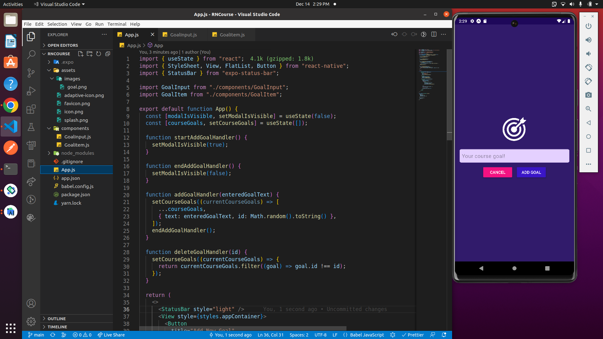

# Basic React Native App
This is the first learning project of the Udemy React Native Course.  It is a mobile app that allows the user to add and delete items.  Expo Go was used for the Android mobile phone simulation. 

[williamlowrimore.com](https://www.williamlowrimore.com)